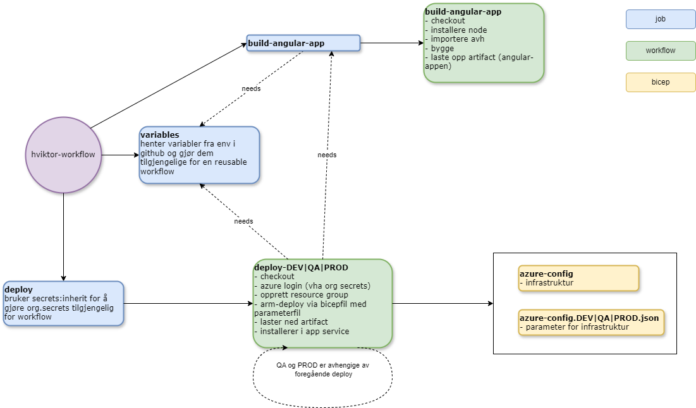
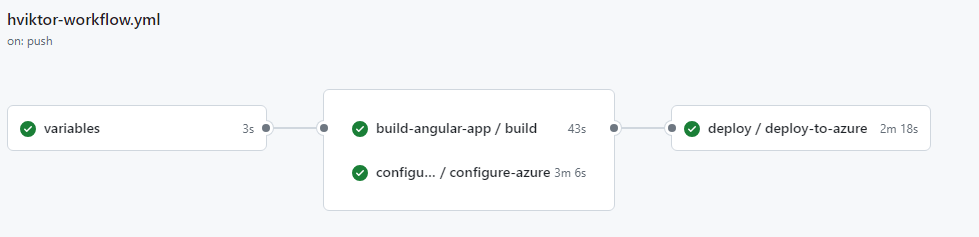

Figur

hviktor-workflow.yml er hovedfilen og de andre er workflows som kan gjenbrukes. En typisk kjøring ser slik ut:

Hva annet må være på plass?
- app reg for subscription må være opprettet. Hos oss heter de hvi-utvikling-github-[dev|qa|prod]-serviceconnection. De er opprettet etter beskrivelsen: [GitHub Actions authentication methods for Azure](https://dev.to/pwd9000/bk-1iij) som igjen er basert på  [Microsoft sin dokumentasjon](https://learn.microsoft.com/en-us/azure/developer/github/connect-from-azure?tabs=azure-portal%2Cwindows).

- Det er blitt laget noen script for å: 
>1. Opprette en app registration [Orsl-Create-ServicePrincipal.ps1](https://github.com/HelseVestIKT/ORSL-scripts/blob/main/Github/Orsl-Create-ServicePrincipal.ps1)
>2. Gi et repo rettigheter til å bruke app reg definert over [Orsl-Create-Federated-Credentials.ps1](https://github.com/HelseVestIKT/ORSL-scripts/blob/main/Github/Orsl-Create-Federated-Credentials.ps1). Merk at denne rettigheten (Federated credentials) er gitt på branch-nivå. Så dersom main har fått lov til å bruke app reg så har ikke develop tilgang får man har kjørt dette scriptet og lagt det til som en gyldig branch for å bruke app reg-en.
Disse scriptene må kjøres av en som har rettigheter til å opprette/endre app reg i Entra ID

- Clientid, tenantid og subscriptionid blir hentet fra secrets som er lagret på organisasjonsnivå i vår Github. Disse secretene er kun tilgjengelig for de repoene som har fått tillatelse. Så dersom et nytt repo blir opprettet og skal bruke dem må en Github admin gi tilgang.